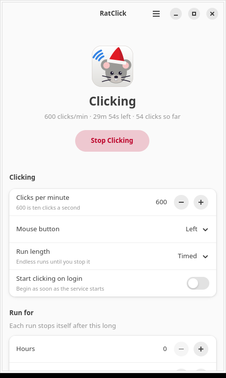
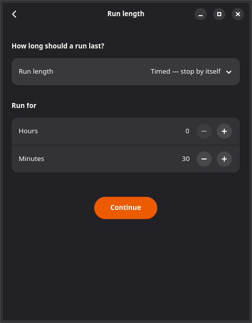
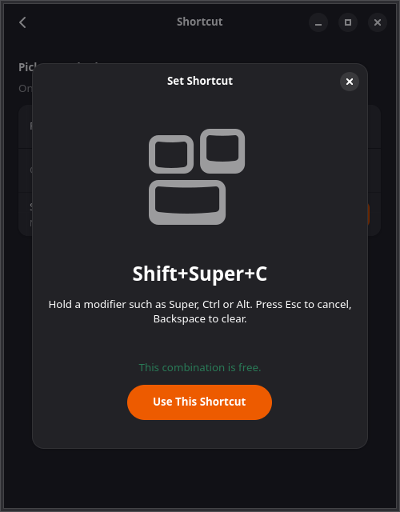

<p align="center">
  
</p>

# RatClick

An auto-clicker for GNOME. Pick a click rate, a mouse button and how long a run
should last, then start it from the window, from a global keyboard shortcut, or
from the command line.

Clicks come from a virtual pointer created through the kernel `uinput` device,
so they work under Wayland as well as X11 — no `XTEST`, no compositor
cooperation required.

## Install

```bash
sudo install -d -m 0755 /etc/apt/keyrings
curl -fsSL -o /tmp/ratclick.asc https://dixonsolutions.github.io/ratclick/ratclick.asc \
  && grep -q 'BEGIN PGP PUBLIC KEY' /tmp/ratclick.asc \
  && sudo install -m 0644 /tmp/ratclick.asc /etc/apt/keyrings/ratclick.asc \
  && echo "deb [signed-by=/etc/apt/keyrings/ratclick.asc] https://dixonsolutions.github.io/ratclick/apt stable main" \
     | sudo tee /etc/apt/sources.list.d/ratclick.list >/dev/null \
  && sudo apt update \
  && sudo apt install ratclick
```

The `&&` chain matters: it writes the sources file only once the signing key is
really in `/etc/apt/keyrings`, so a failed download leaves nothing behind rather
than a repository `apt update` cannot verify.

The dnf equivalent, what to do if `apt update` is already complaining, and how
to install the `.deb`/`.rpm` directly from a release, are in
[docs/install.md](docs/install.md).

Then run `ratclick gui`. The first launch walks you through the four decisions
that matter — rate, button, run length, shortcut — and nothing is written until
you finish.

<p align="center">
  
  
  
</p>

## Using it

```bash
ratclick gui        # open the window
ratclick toggle     # start if stopped, stop if running — what the shortcut runs
ratclick status     # what is it doing right now
ratclick doctor     # check the install and report anything that would break it
```

Settings can be changed without opening the window:

```bash
ratclick config set cpm 900
ratclick config set button right
ratclick config set duration 1h30m     # also accepts 90 or 1:30
```

A run is either **endless** — until you toggle it off — or **timed**. Timed runs
are stored in whole minutes and shown as hours + minutes, and the daemon stops
itself when the time is up.

`man 1 ratclick` documents every subcommand.

## The toggle shortcut

One key combination starts and stops clicking. RatClick can register it three
different ways, because no single mechanism works everywhere:

| Backend | Registered by | Needs root | Works outside GNOME |
| --- | --- | --- | --- |
| `gnome` | a GNOME custom keybinding (gsettings) | no | no |
| `extension` | the Shell extension, via `Main.wm.addKeybinding` | no | no |
| `keyd` | [keyd](https://github.com/rvaiya/keyd), at the evdev layer | yes | yes, including a TTY |

```bash
ratclick shortcut check '<Super><Shift>c'   # is it free?
ratclick shortcut set   '<Super><Shift>c'   # take it
ratclick shortcut set   '<Super>F9' --backend keyd --force
ratclick shortcut list                      # every shortcut the desktop has bound
```

Before taking a combination, RatClick scans every schema GNOME keeps shortcuts
in — window manager, Shell, Mutter, media keys and existing custom shortcuts —
plus everything in `/etc/keyd`, and tells you what it would collide with.
`--force` unbinds the other holder first.

After installing, the binding is **read back** from the backend rather than
assumed, so a write that silently failed is reported instead of looking like
success.

### keyd notes

keyd runs as root and has no session of its own, so the binding invokes
`/usr/libexec/ratclick/ratclick-keyd-dispatch`, which finds the active graphical
session, drops to that user with their full group membership, and runs
`ratclick toggle` on their session bus.

RatClick appends a marked block to *every* file in `/etc/keyd` rather than
adding one of its own. keyd picks a single config per keyboard, so a new file
with `[ids] *` would quietly lose to an existing `default.conf`. Removal deletes
exactly the marked block, restoring the original files byte for byte.

## The GNOME Shell extension

Optional. It adds a Quick Settings toggle with the live click rate and
countdown, plus a panel indicator that appears only while clicking is armed —
useful, because a clicker you have forgotten about is a nuisance.

It is **not** on extensions.gnome.org; it installs from the release zip. See
[docs/extension.md](docs/extension.md).

## Permissions

The daemon needs write access to `/dev/uinput`. The packaged udev rule grants it
to the `input` group; add yourself and log in again:

```bash
sudo usermod -aG input $USER
```

Anyone in `input` can already read every keystroke on the system, so this does
not widen the trust boundary — but it is worth knowing. `ratclick doctor` tells
you whether it is in place.

## Building from source

Rust 1.82 or newer, plus GTK 4 and libadwaita development packages.

```bash
sudo apt install libadwaita-1-dev libgtk-4-dev libudev-dev
cargo build --release --workspace
```

`scripts/build-packages.sh` turns that into a `.deb` and an `.rpm` under
`dist/`.

### Testing

`cargo test --workspace` covers the pure logic. The click engine has an
integration suite that drives a real `uinput` device; it is ignored by default
because it needs `/dev/uinput`:

```bash
cargo test -p ratclick-daemon -- --ignored --test-threads=1
```

Those tests call `EVIOCGRAB` on the virtual pointer before clicking, so the
events they generate cannot reach your desktop.

For anything that touches gsettings, use the throwaway session harness — GNOME
shortcuts live in per-*user* dconf, so testing in your own session would rewrite
your real keybindings:

```bash
scripts/nested-session.sh start          # headless GNOME 50 with its own dconf and bus
scripts/nested-session.sh run ratclick shortcut set '<Super>F9'
scripts/nested-session.sh reset
```

It refuses to start unless it can prove that settings written inside it are
invisible outside.

## Layout

| Directory | Contents |
| --- | --- |
| `crates/ratclick-core` | configuration, accelerators, shortcut backends |
| `crates/ratclick-daemon` | click engine and the session D-Bus service |
| `crates/ratclick-cli` | the `ratclick` command |
| `crates/ratclick-gui` | the libadwaita front end |
| `extension/` | GNOME Shell extension |
| `data/` | units, D-Bus and desktop files, udev rule, man page, AppStream |
| `packaging/` | `.deb` and `.rpm` metadata |
| `scripts/` | package, repository and test-session builders |

Releases are cut by pushing a version bump to `main`: the workflow builds both
packages, publishes a GitHub release, and regenerates the signed apt and dnf
repositories on GitHub Pages.

## Licence

GPL-3.0-or-later.
